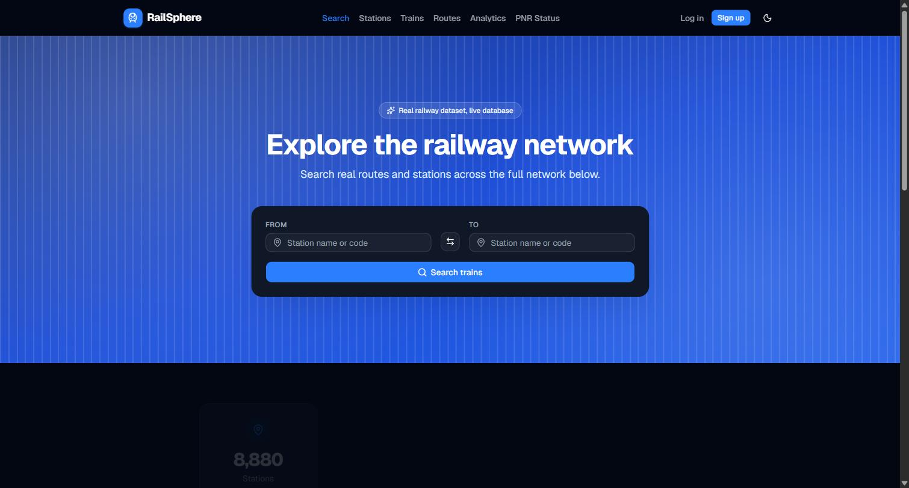
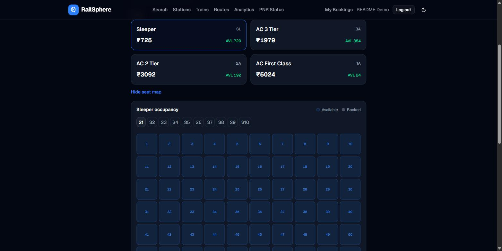
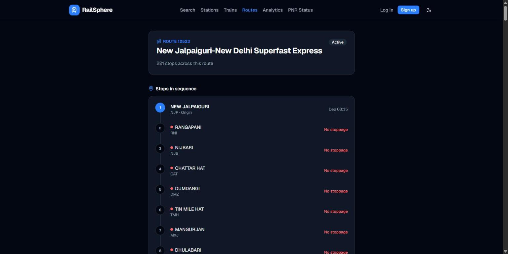
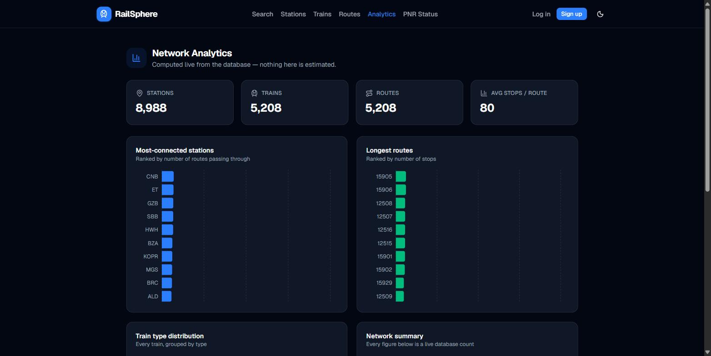
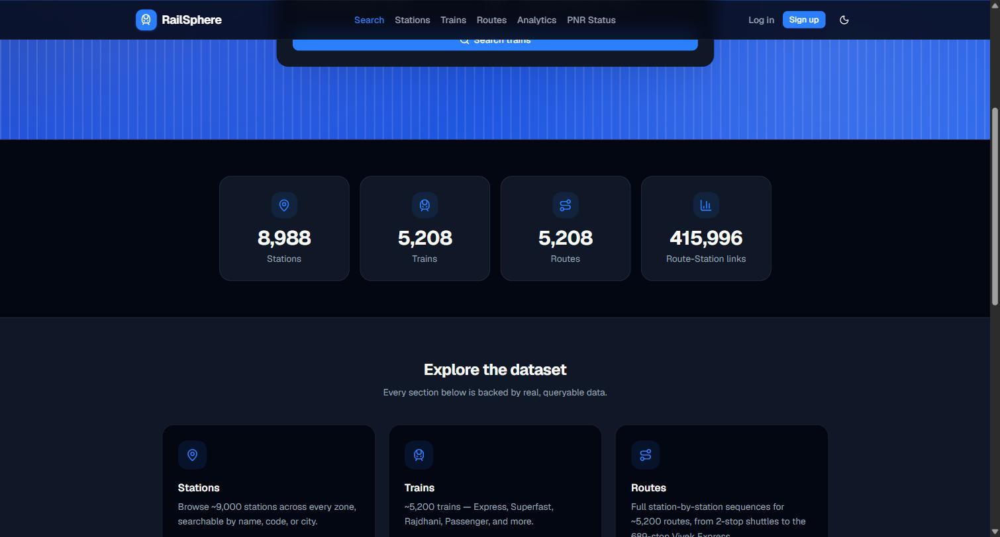
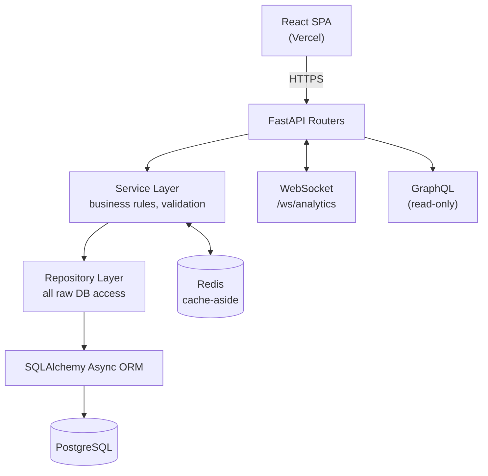
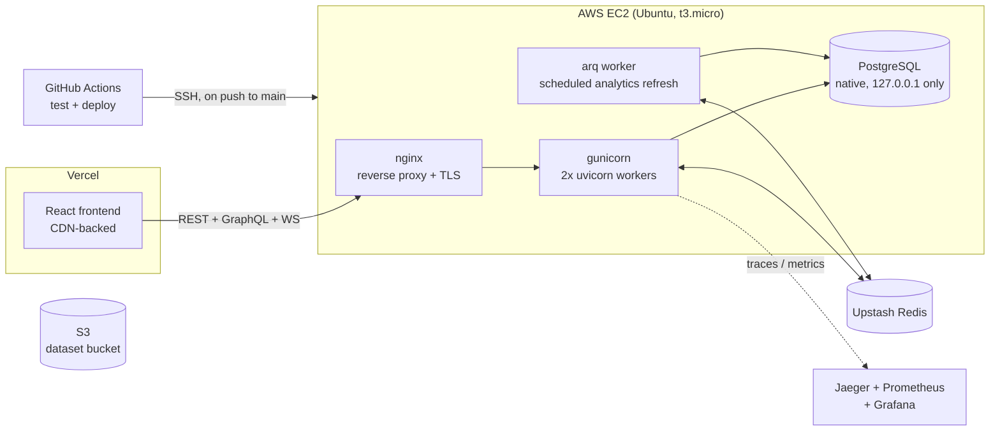

<div align="center">


# RailSphere

**A full-stack Indian Railways platform — real data, real booking logic, real infrastructure.**

Built solo, end to end: React frontend, FastAPI backend, a 400K+ row PostgreSQL dataset,
and a production deployment with monitoring, tracing, caching, and CI/CD.

[](https://github.com/rohantiwari9573/railsphere-backend/actions/workflows/ci.yml)


[](LICENSE)

**[Live App](https://railsphere-frontend.vercel.app)** · **[API Docs (Swagger)](https://16-176-230-154.nip.io/docs)** · **[GraphQL Playground](https://16-176-230-154.nip.io/graphql)**

</div>

<br />



<table>
<tr>
<td width="50%"><p align="center"><sub>Live per-coach seat occupancy during booking</sub></p></td>
<td width="50%"><p align="center"><sub>Pass-through vs. real stops, inferred from the raw schedule data</sub></p></td>
</tr>
<tr>
<td width="50%"><p align="center"><sub>Network analytics, computed live from the database</sub></p></td>
<td width="50%"><p align="center"><sub>~9,000 stations, ~5,200 trains, 416,000+ route-station links</sub></p></td>
</tr>
</table>

---

## Table of Contents

- [What This Is](#what-this-is)
- [Features](#features)
- [Tech Stack](#tech-stack)
- [Architecture](#architecture)
- [Project Structure](#project-structure)
- [Getting Started](#getting-started)
- [Testing](#testing)
- [Deployment](#deployment)
- [API Documentation](#api-documentation)
- [Roadmap](#roadmap)
- [Author](#author)

---

## What This Is

RailSphere started as a backend exercise — model a real railway network in PostgreSQL and expose it over a clean API. It's since grown into a full platform: a React frontend, a working IRCTC-style ticket booking system with seat allocation and waitlisting, and a production deployment with the kind of observability and hardening you'd expect from a real service, not a class project.

Everything queries a real, imported dataset — **~9,000 stations, ~5,200 trains, ~5,200 routes, 416,000+ route-station links** — no mock data, anywhere.

> I'm a final-year B.Tech student; this is my main portfolio project. It's deliberately over-engineered in places (partitioned tables, distributed tracing, a monitoring stack) because I wanted to actually practice the infrastructure, not just read about it.

---

## Features

| | |
|---|---|
| 🎟️ **Full ticket booking system** | Search → live seat availability by class → animated seat-occupancy map → passenger details → mock payment → PNR e-ticket with QR code and PDF download |
| ⏳ **Real waitlisting logic** | Once a class fills, new passengers are waitlisted; cancelling a confirmed seat automatically promotes the longest-waiting passenger into it — across bookings, not just within one |
| 🔎 **Fuzzy search everywhere** | Trigram (`pg_trgm`) similarity search across stations and trains, ranked by match quality |
| 🚦 **Stoppage detection** | The dataset has no explicit "does the train stop here" flag — inferred instead from arrival/departure time deltas and shown as green (stop) vs. red (pass-through) on the route timeline |
| 📊 **Live network analytics** | Most-connected stations, longest routes, train-type distribution — real aggregate queries, not precomputed fixtures |
| 🔌 **WebSocket live updates** | Analytics push live over `/ws/analytics` when the underlying materialized views refresh |
| 🧵 **GraphQL alongside REST** | A read-only GraphQL API (Strawberry) runs next to the REST API for the same data |
| 🌗 **Dark / light theme** | Full theme system with no flash-of-wrong-theme on load |
| 🔐 **Security-conscious by default** | JWT auth, Argon2 password hashing, field-level encryption at rest for PII (Fernet + HMAC blind index), per-IP rate limiting, hardened EC2 security group |
| 📈 **Real observability** | OpenTelemetry distributed tracing (Jaeger), Prometheus metrics, and a provisioned-as-code Grafana dashboard — not bolted on, wired into every request |
| ⚡ **Performance work that's actually measured** | Redis cache-aside layer with a circuit breaker, gzip compression, HTTP caching (`ETag`/`Cache-Control`), a 415k-row table hash-partitioned across 8 partitions, load-tested with Locust |
| 🚀 **Real CI/CD** | Every push runs the test suite against a live Postgres container, then deploys over SSH and runs migrations automatically |

---

## Tech Stack

**Frontend**


**Backend**


**Data & Infra**


**Observability**


**CI/CD & Testing**


---

## Architecture

### Request flow

Every domain (auth, stations, trains, routes, route-stations, journeys, bookings) follows the same strict layering — routes never touch the database directly, they only call a service, which only calls a repository. Wired in one place: `app/api/dependencies.py`.



### Deployment topology



---

## Project Structure

```text
RailSphere/
├── .github/workflows/ci.yml     # test suite + auto-deploy on push
├── frontend/                    # React + Vite + TypeScript SPA
│   ├── src/
│   │   ├── api/                 # typed API client functions
│   │   ├── components/          # UI components (booking, routes, stations, ui/)
│   │   ├── context/              # auth + theme providers
│   │   └── pages/                # route-level pages
│   └── vercel.json
├── backend/
│   ├── alembic/                 # migrations (single verified baseline + incremental changes)
│   ├── app/
│   │   ├── api/                 # routers + dependency injection wiring
│   │   ├── core/                 # config, JWT, encryption, tracing, rate limiting, fare/seat rules
│   │   ├── db/                   # engine/session
│   │   ├── graphql/              # Strawberry GraphQL schema
│   │   ├── importers/            # dataset import pipeline
│   │   ├── models/                # SQLAlchemy models
│   │   ├── repositories/          # DB access layer
│   │   ├── schemas/                # Pydantic request/response models
│   │   └── services/               # business logic layer
│   ├── deploy/                  # systemd units + nginx config used on EC2
│   ├── loadtest/                # Locust load-test scenarios
│   ├── scripts/                 # backup + per-dataset import entry points
│   ├── tests/                   # pytest suite (72 tests)
│   └── run.py                   # Windows-safe local dev launcher (see note below)
├── monitoring/                  # Prometheus + Grafana, provisioned as code
└── docs/
```

---

## Getting Started

### Docker (fastest way to run everything)

Brings up the API, Postgres, Redis, Jaeger, Prometheus, Grafana, and the background worker with nothing installed but Docker:

```bash
git clone https://github.com/rohantiwari9573/railsphere-backend.git
cd railsphere-backend
docker compose up --build
```

- API: `http://localhost:8000`
- Jaeger UI (request traces): `http://localhost:16686`
- Grafana (anonymous admin, no login needed locally): `http://localhost:3001` — the "RailSphere Overview" dashboard is auto-provisioned

The database starts empty — the real dataset (`backend/datasets/*.json`, ~95MB) isn't in this repo. To populate it:

```bash
docker compose exec backend python -m app.importers.import_all
```

`docker compose down` stops everything; add `-v` to also drop the Postgres volume.

<details>
<summary><strong>Local development without Docker</strong></summary>

<br />

**Backend**

```bash
cd railsphere-backend/backend
python -m venv .venv
# Windows: .venv\Scripts\activate   Linux/macOS: source .venv/bin/activate
pip install -r requirements.txt        # or requirements-dev.txt to run tests too
```

Copy `.env.example` to `.env`, fill in `DATABASE_URL` and `SECRET_KEY` at minimum, then:

```bash
alembic upgrade head
```

**Windows:** use `python run.py`, not `uvicorn app.main:app --reload` directly. psycopg's async driver can't run on Windows' default `ProactorEventLoop`, and uvicorn's own CLI creates its event loop *before* importing the app module — too late to apply the fix. `run.py` sets the correct event loop policy first.

**Linux/macOS:** either works — `uvicorn app.main:app --reload` or `python run.py`.

Optionally populate the dataset:

```bash
python -m app.importers.import_all
```

**Frontend**

```bash
cd railsphere-backend/frontend
npm install
npm run dev
```

Set `VITE_API_BASE_URL` in `frontend/.env.local` to point at your backend.

</details>

---

## Testing

```bash
pip install -r requirements-dev.txt
createdb railsphere_test          # one-time
DATABASE_URL=postgresql+psycopg://postgres:<password>@localhost:5432/railsphere_test alembic upgrade head
pytest -v
```

72 tests, each running inside a database transaction that's rolled back afterward, so the test DB stays empty between runs regardless of order. CI runs this same suite against a fresh Postgres container on every push/PR to `main`.

---

## Deployment

**Backend** — a single AWS EC2 instance (Ubuntu, t3.micro):

- **App**: `backend/deploy/railsphere.service` — a systemd unit running `gunicorn` with 2 `uvicorn.workers.UvicornWorker` processes, bound to `127.0.0.1:8000`
- **Reverse proxy**: `backend/deploy/nginx.conf` — nginx handling TLS (via a free nip.io wildcard domain + Let's Encrypt), gzip compression, and `X-Forwarded-*` headers
- **Database**: PostgreSQL running natively on the same instance, bound to `127.0.0.1` only — never exposed to the internet
- **Cache**: Upstash-hosted Redis for cache-aside reads and the analytics-refresh worker
- **Backups**: automated daily `pg_dump` → gzip → local disk (7-day retention) via a systemd timer

**Frontend** — deployed to Vercel, CDN-backed, auto-deployed on push.

**CI/CD** — every push to `main` runs the full test suite against a live Postgres container, then (on success) SSHes into EC2, pulls, installs dependencies, runs `alembic upgrade head`, and restarts the service. See `.github/workflows/ci.yml`.

---

## API Documentation

- Swagger UI: **https://16-176-230-154.nip.io/docs**
- ReDoc: **https://16-176-230-154.nip.io/redoc**
- GraphQL Playground: **https://16-176-230-154.nip.io/graphql**

---

## Roadmap

<details open>
<summary><strong>Core platform</strong></summary>

- [x] FastAPI project setup, async SQLAlchemy, Alembic (single verified migration baseline)
- [x] JWT authentication (register/login/current user)
- [x] Stations, trains, routes, route-stations, schedules — full CRUD where applicable
- [x] Data import pipeline, idempotent, populated with the real dataset
- [x] Trigram search (`pg_trgm`) with similarity-ranked results
- [x] React + TypeScript frontend deployed to Vercel, with dark/light theming
- [x] Read-only GraphQL API alongside REST (`/graphql`)
- [x] WebSocket live analytics updates

</details>

<details open>
<summary><strong>Booking system</strong></summary>

- [x] Seat capacity, coach/berth layout, and fare rules modeled per class (SL/3A/2A/1A/CC/2S)
- [x] Sequential seat allocation with automatic waitlisting once a class fills
- [x] Cross-booking waitlist promotion when a confirmed seat is cancelled
- [x] Mock payment flow, PNR generation, e-ticket with QR code + PDF download
- [x] Public PNR status lookup, "My Bookings", cancellation with refund breakdown
- [x] Route timeline stoppage detection (pass-through vs. real stop, inferred from schedule data)

</details>

<details open>
<summary><strong>Performance & reliability</strong></summary>

- [x] Materialized views for analytics, refreshed by a scheduled background job
- [x] Redis cache-aside layer for hot read paths, with a circuit breaker around cache calls
- [x] `route_stations` (415k+ rows) hash-partitioned by `route_id` across 8 partitions
- [x] gzip response compression + HTTP caching (`Cache-Control`/`ETag`, conditional `304`s)
- [x] SQLAlchemy async connection pool sized for the production instance's memory budget
- [x] Load-tested with Locust (`backend/loadtest/README.md`)

</details>

<details open>
<summary><strong>Security & observability</strong></summary>

- [x] Field-level encryption at rest for `User.email` (Fernet + HMAC blind index for lookups)
- [x] Request-id tracing + per-IP rate limiting
- [x] EC2 security group hardened: closed the direct gunicorn port, documented the SSH tradeoff
- [x] OpenTelemetry distributed tracing (Jaeger), opt-in via `OTEL_EXPORTER_OTLP_ENDPOINT`
- [x] Prometheus + Grafana monitoring stack, provisioned as code, with a live dashboard

</details>

<details open>
<summary><strong>Infra & delivery</strong></summary>

- [x] Docker + docker-compose (API, Postgres, Redis, Jaeger, Prometheus, Grafana, worker)
- [x] CI/CD auto-deploy to EC2 on push to `main`, migrations run automatically
- [x] Automated daily Postgres backups (`pg_dump` → gzip → local disk, 7-day retention)
- [x] Dataset files (95MB) hosted on S3, private bucket

</details>

---

## Author

<div align="center">

**Rohan Tiwari** — Aspiring SDE, Final Year B.Tech Student

[](https://github.com/rohantiwari9573)
&nbsp;|&nbsp;
[](https://www.linkedin.com/in/rohan-tiwari-012106283/)

</div>
